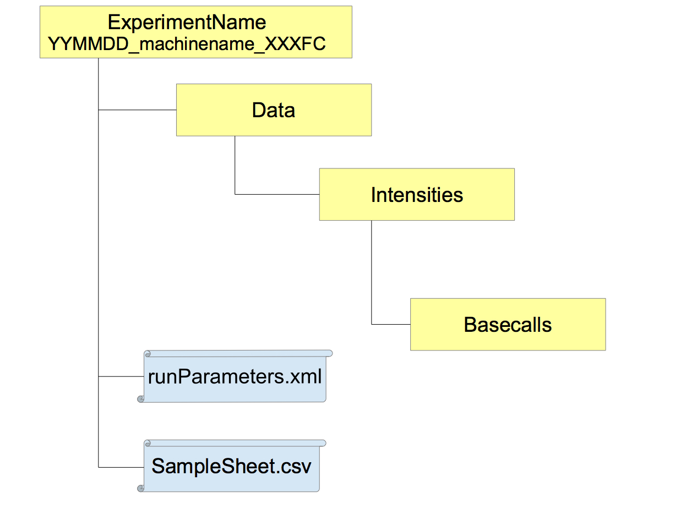
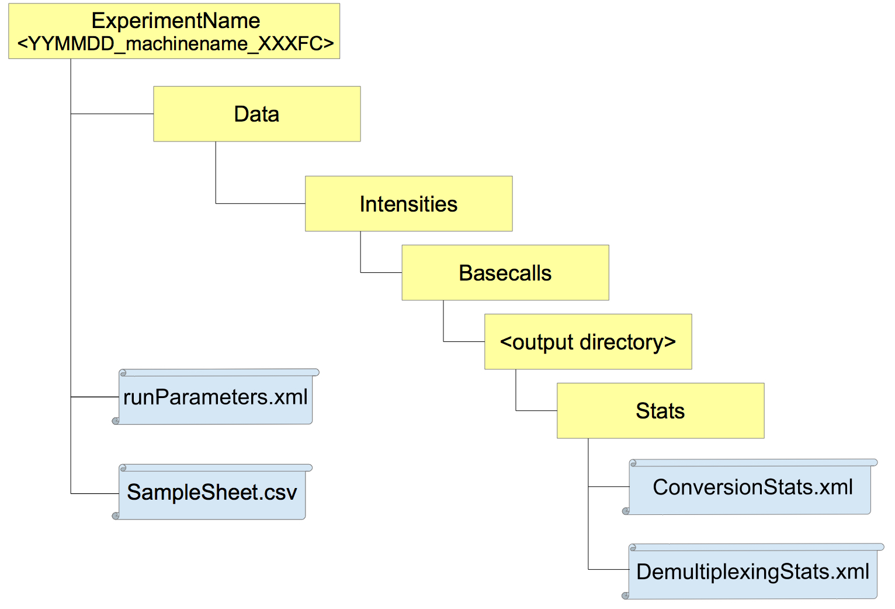

# The bcl2Fastq software

The bcl2Fastq software converts basecalls from Illumina High Throughput Sequencing (HTS) machines to fastQ files containing sequence information ready for further analysis. 

The conversion of basecalls using the bcl2Fastq software requires multiple input files and parameters which allow the software to correctly basecall as well as demultiplex data into relevant samples by any index information contained within the data. 

For detailed information on the latest version of bcl2Fastq software, its' installation, its' required input files and generated output files visit the Illumina software's website [here](https://support.illumina.com/content/dam/illumina-support/documents/documentation/software_documentation/bcl2fastq/bcl2fastq2_guide_15051736_v2.pdf).


## Input files for bcl2Fastq.

The bcl2Fastq software converts basecalls generated by Illumina's Real Time Analysis (RTA) software to fastQ files. The output from RTA is presented in the directory structure below alongside the required input files **runParameters.xml** and a user generated **SampleSheet.csv**.



**runParameters.xml** - The runParameters.xml is generated by the RTA software during basecalling. This XML file contains information including RTA version, HTS machine used, specification of reads and indexes and number of cycles per read/index.

**SampleSheet.csv** - A user generated sample sheet , by default to be named SampleSheet.csv, may be present at the top level of directory structure to allow for specification of indexes to Sample IDs/Names. For bcl2Fastq versions >= 2.1.7, this SampleSheet.csv must contain set column names defining samples and their indexes ( *Lane*, *Sample_ID*, *Sample_Name*, *Sample_Project*, *Index*, *Index2*). For more details of sample sheet generation see the [Illumina manual](https://support.illumina.com/content/dam/illumina-support/documents/documentation/software_documentation/bcl2fastq/bcl2fastq2_guide_15051736_v2.pdf).

## Output files from bcl2Fastq.

Alongside generated fastQ files from basecalls, bcl2Fastq produces several output files containing metrics describing the sequencing run. The **ConversionStats.xml** and **DemultiplexingStats.xml** files are provided under the Stats folder in the user specified output directory.



**ConversionStats.xml** - This XML contains information on basecalling per tile including the *Cluster count*, *Yield*, *YieldQ30* and *QualityScoreSum*. 


**DemultiplexingStats.xml** - This XML contains information on the demultiplexing of samples including the *total*, *perfectmatch* and *mismatched* *barcode counts*.

# The basecallQC package

The **basecallQC** package provides a set of tools to streamline basecalling and demultiplexing using the Illumina bcl2fastq software (versions >= 2.1.7).

The **basecallQC** package includes functions to:- 

- "Clean" Illumina bcl2fastq (versions >= 2.1.7) samplesheets e.g. Remove invalid sample names/IDs, whitespaces, correct column headers
- Convert Samplesheets from Illumina bcl2fastq versions <= 1.8.9 to be compatable to Illumina bcl2fastq versions >= 2.1.7.
- Create base masks for use with the Illumina basecalling/demultiplexing software bcl2fastq (versions >= 2.1.7).
- Create summary tables and plots from Illumina basecalling/demultiplexing with bcl2fastq (versions >= 2.1.7).

## Working with inputs for bcl2fastq (versions >= 2.1.7)

### Cleaning and updating the Sample Sheet

The Illumina bcl2fastq program needs a sample sheet to dictate sample names/IDs, indexes and parameters for basecalling and demultiplexing. 

The construction of sample sheets for basecalling and demultiplexing requires specific column names,valid Sample names/IDs and correct indexes. The complexity of working with Illumina sample sheets is compounded by the use of different sample sheet specifications before and after version 1.8.9 of the bcl2fastq program.

The **basecallQC** package uses the **validateBCLSheet()** function to both "clean" sample sheets to have valid column and sample names as well as to update sample sheets for versions <= 1.8.9 to be compatable with version >= 2.1.7   

To update or clean a sample sheet, first the parameters for the Run must be captured using the **BCL2FastQparams()** function. The resulting  **BCL2FastQparams** object contains information on the Run parsed from the runParameters.xml file such as the actual index length (often required to correct the sample sheet specified lengths). 

Once the **BCL2FastQparams** object has been created, a sample sheet file name can be passed to  **validateBCLSheet()** function alongside the **BCL2FastQparams** object to create a valid sample sheet data.frame,  which may then be written to file.

#### Cleaning a sample sheet.

In this first example we use the **validateBCLSheet** function to clean a sample sheet to be valid with bcl2Fastq versions >= 2.1.7.

```{r, cleaning, fig.show='hold',warning=FALSE,message=FALSE}
library(basecallQC)
fileLocations <- system.file("extdata",package="basecallQC")
config <- dir(fileLocations,pattern="config.ini",full.names=TRUE)
fileLocations <- system.file(file.path("extdata","testSampleSheets"),package="basecallQC")
runXML <- dir(fileLocations,pattern="runParameters.xml",full.names=TRUE)
sampleSheet <- dir(fileLocations,pattern="*\\.csv",full.names=TRUE)
read.delim(sampleSheet[1],sep=",",header = TRUE,comment.char = "[")

```

This sample sheet contains invalid Sample names e.g. A 1 (whitespace) and 08.HDOX37 (starts with numeric) as well as invalid column headers such as "Name". 

```{r, cleaning2, fig.show='hold',warning=FALSE,message=FALSE}

bcl2fastqparams <- BCL2FastQparams(runXML,config,runDir=getwd(),verbose=FALSE)
cleanedSampleSheet <- validateBCLSheet(sampleSheet[1],param=bcl2fastqparams)
head(cleanedSampleSheet)

```

In the cleaned samplesheet the column headers have been corrected and invalid Sample IDs converted to valid IDs e.g.  08.HDOX37 has been converted to Sample_HDOX37

#### Updating a sample sheet.

Updating a sample sheet from those used with versions <= 1.8.9 to one compatable with versions >= 2.1.7 is done following the same procedure as cleaning a sample sheet.


```{r, updating, fig.show='hold',warning=FALSE,message=FALSE}
library(basecallQC)
fileLocations <- system.file("extdata",package="basecallQC")
config <- dir(fileLocations,pattern="config.ini",full.names=TRUE)
fileLocations <- system.file(file.path("extdata","testSampleSheets"),package="basecallQC")
runXML <- dir(fileLocations,pattern="runParameters.xml",full.names=TRUE)
sampleSheet <- dir(fileLocations,pattern="*\\.csv",full.names=TRUE)
read.delim(sampleSheet[2],sep=",",header = TRUE,comment.char = "[")

```

The sample sheet from versions <= 1.8.9 contains many headers which will need to be updated to those used in versions >= 2.1.7 as well as unrequired headers which are maintained as metadata.

The specification of indexes in sample sheets from versions <= 1.8.9 were in a single column with indexes separated by a hyphon. This specification has changed to the explicit inclusion of an Index2 column when using dual indexes, so this to must be updated too.

```{r, updating2, fig.show='hold',warning=FALSE,message=FALSE}

bcl2fastqparams <- BCL2FastQparams(runXML,config,runDir=getwd(),verbose=FALSE)
cleanedSampleSheet <- validateBCLSheet(sampleSheet[2],param=bcl2fastqparams)
head(cleanedSampleSheet)

```

In the resulting updated sample sheet we can see column names have been updated e.g.  "SampleID" to "Sample_ID",  and the index column has been automatically split into Index and Index2 columns.

### Base masking and the bcl2fastq command.

The **basecallQC** package can also provide the base masks and basecalling/demultiplexing command for bcl2fastq versions >= 2.1.7 from the cleaned sample sheet and the **BCL2FastQparams** object.

The **createBaseMasks()** function creates a data.frame of basemasks per lane from a cleaned sample sheet,as generated by the **validateBCLsheet()** function, and a **BCL2FastQparams** object.

```{r, basemasks, fig.show='hold',warning=FALSE,message=FALSE}
fileLocations <- system.file("extdata",package="basecallQC")
runXML <- dir(fileLocations,pattern="runParameters.xml",full.names=TRUE)
config <- dir(fileLocations,pattern="config.ini",full.names=TRUE)
sampleSheet <- dir(fileLocations,pattern="*\\.csv",full.names=TRUE)
bcl2fastqparams <- BCL2FastQparams(runXML,config,runDir=getwd(),verbose=FALSE)
cleanedSampleSheet <- validateBCLSheet(sampleSheet,param=bcl2fastqparams)
baseMasks <- createBasemasks(cleanedSampleSheet,param=bcl2fastqparams)
baseMasks$index1Mask
```

Following the creation of a base masks data.frame, the **createBCLcommand** function takes the cleaned sample sheet, a **BCL2FastQparams** object and the base masks data.frame to create the command to be used for Illumina basecalling/demultiplexing using  bcl2fastq versions >= 2.1.7.

The command is returned as a character string to allow the user to control submission of the command to best fit the user's system.

```{r, submitCommand, fig.show='hold',warning=FALSE,message=FALSE}
toSubmit <- createBCLcommand(bcl2fastqparams,cleanedSampleSheet,baseMasks)
toSubmit
```


```{r, basecallQCforMetrics, fig.show='hold',eval=T,echo=F,warning=FALSE,message=FALSE}
fileLocations <- system.file("extdata",package="basecallQC")
runXML <- dir(fileLocations,pattern="runParameters.xml",full.names=TRUE)
config <- dir(fileLocations,pattern="config.ini",full.names=TRUE)
sampleSheet <- dir(fileLocations,pattern="*\\.csv",full.names=TRUE)
outDir <- file.path(fileLocations,"Runs/161105_D00467_0205_AC9L0AANXX/C9L0AANXX/")
bcl2fastqparams <- BCL2FastQparams(runXML,config,runDir=getwd(),outDir,verbose=FALSE)
bclQC <- basecallQC(bcl2fastqparams,RunMetaData=NULL,sampleSheet)
```
## Working with outputs from bcl2fastq (versions >= 2.1.7)

Alongside generating fastQ from basecalls, the bcl2fastq software (versions >= 2.1.7) produces a number of basecalling and demultiplexing metric outputs in differing file types. The **basecallQC** package retrieves information from basecalling and demultiplexing XML files, *ConversionStats.xml* and *DemultiplexingStats.xml* respectively.

The **baseCallMetrics()** function accepts the **BCL2FastQparams** object for the Run and retrieve metrics from the *ConversionStats.xml* file.

```{r, bclSummary, fig.show='hold',warning=FALSE,message=FALSE}
bclMetrics <- baseCallMetrics(bcl2fastqparams)
head(bclMetrics[[1]])
```

The **baseCallMetrics()** function returns a list where the first element contains the full unsummarised basecalling metrics from the  *ConversionStats.xml* file. The second element contains these metrics summarised by Sample, Lane and Tile.

In the same way, the **demultiplexMetrics()** function accepts the **BCL2FastQparams** object for the Run and retrieve metrics from the *DemultiplexingStats.xml* file.

```{r, demuxSummary, fig.show='hold',warning=FALSE,message=FALSE}
demuxMetrics <- demultiplexMetrics(bcl2fastqparams)
head(demuxMetrics[[1]])

```

Again the **demultiplexMetrics()** function returns a list where the first element contains the full unsummarised demultiplexing metrics from the  *DemultiplexingStats.xml* file. The second element contains these metrics filtered to sample information.

The lists objects generated by **demultiplexMetrics()** and **baseCallMetrics()** functions may then be used by plotting and table reporting functions shown in [Section 3](# Plots, tables and reports with basecallQC).

## Running the basecallQC pipeline

The **basecallQC** package provides a pipeline function, **basecallQC()**, to allow the user to clean/convert the samplesheet, create the bcl2fastq command and parse any basecalling/demultiplexing results. The resulting **basecallQC** object can then be used to produce summary tables, plots and a report.

The **basecallQC()** function takes a **BCL2FastQparams** object for the Run, a sample sheet and any Run metadata that the user wishes to attach to their experiment and returns a **basecallQC** object.

The resulting **basecallQC** object can be used with **basecallQC**'s plotting and reporting functions.

```{r, basecallQC, fig.show='hold',eval=F,warning=FALSE,message=FALSE}
fileLocations <- system.file("extdata",package="basecallQC")
runXML <- dir(fileLocations,pattern="runParameters.xml",full.names=TRUE)
config <- dir(fileLocations,pattern="config.ini",full.names=TRUE)
sampleSheet <- dir(fileLocations,pattern="*\\.csv",full.names=TRUE)
outDir <- file.path(fileLocations,"Runs/161105_D00467_0205_AC9L0AANXX/C9L0AANXX/")
bcl2fastqparams <- BCL2FastQparams(runXML,config,runDir=getwd(),outDir,verbose=FALSE)
bclQC <- basecallQC(bcl2fastqparams,RunMetaData=NULL,sampleSheet)
class(bclQC)
```

```{r, basecallQC2, fig.show='hold',eval=F,eval=T,echo=F,warning=FALSE,message=FALSE}
class(bclQC)
```


# Plots, tables and reports with basecallQC. 

## Plotting and Tables.

The **basecallQC** object and the lists returned from **baseCallMetrics()**/**demultiplexMetrics()** functions contain metrics on basecalling and/or demultiplexing for the Run. The objects can be used for both plotting and table reporting using the **basecallQC** functions seen in this section. In this following section we will demonstrate plotting from a **basecallQC** object.

Summary HTML tables from demultiplexing and basecalling results can be generated using the **summaryDemuxTable** and **summaryConvStatsTable** respectively. The output argument can be set to "static" or "html" to allow for tables for use in non-interactive and interactive modes.


```{r, tables, fig.show='hold',warning=FALSE,message=FALSE}
summaryConvStatsTable(bclQC,output = "html")
summaryDemuxTable(bclQC,output = "html")
```

The user may also visualise the results using **basecallQC**'s plotting functions for basecalling and demultiplexing summary metrics.

The **passFilterBar** function produces a bar plot of yields per sample. The metric to plot and how to summarise data for plotting are controlled by the *metricToPlot* and *groupBy* arguments.

```{r, plots1, fig.show='hold',warning=FALSE,message=FALSE, fig.width=5, fig.height=5}
passFilterBar(bclQC,groupBy="Sample",metricToPlot = "Yield")

```

The **passFilterTilePlot** produces a plot of the specified metric across the Lanes and Tiles of the investigated Run.

```{r, plots2, fig.show='hold',warning=FALSE,message=FALSE, fig.width=5, fig.height=5}

passFilterTilePlot(bclQC,metricToPlot = "Yield")

```

The **demuxBarplot** function produces a bar plot of yield from demultiplexing. For demultiplexing statistics only the *groupBy* arguments can be used.

```{r, plots3, fig.show='hold',warning=FALSE,message=FALSE, fig.width=5, fig.height=5}

demuxBarplot(bclQC,groupBy="Sample")
```

## Producing an HTML report.

The **basecallQC** package allows the user to generate a report per Illumina Run from the **basecallQC** object containing the most important demultiplexing and basecalling metrics using the **reportBCL()** function. 

This report may be customised and the resulting RMD passed to the **reportBCL()** function's *reportRMDfile* argument. This RMD will then be used in place of the standard basecallQC report.

```{r, plots4, eval=F, warning=FALSE,message=FALSE}
reportBCL(bclQC)
```

# Session Info

```{r sessionInfo,echo=F,fig.height=30,fig.width=15}
sessionInfo()
```
